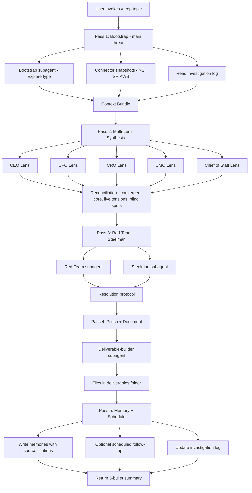

# Strategic AI Operating Model

**Owner:** Russell Teter
**Purpose:** Make Claude Cowork a permanent multi-C-level operating partner for the Class Technologies turnaround — capable of CEO, CFO, CRO, CMO, and Chief-of-Staff-grade work concurrently, with autonomous access to company data, recursive self-improvement, and compounding intelligence across sessions.
**Created:** 2026-05-21
**Status:** Active. This document is the constitution. The companion document `Strategic_AI_Invocation_Guide.md` is the operating manual.

---

## 1. Why this exists

You are stepping into the COO role at a company in cash crisis: ARR falling from $35.85M to $20.57M over 16 months, a weekly cash trough of $111,766 on July 26, 2026, a $30M Barclays facility with covenants live, 41 GTM employees, a board narrative you owe Holdco and Barclays, and a personal compensation negotiation running in parallel. You are simultaneously running Locality AI on the side and a job-hunt campaign as walk-away leverage.

No single Claude session can hold all of that. But a properly designed operating model can — by separating context, lenses, data sources, and the orchestration logic that ties them together, then layering memory and scheduling on top so each session is smarter than the last.

This document defines that architecture.

---

## 2. The five C-level lenses

Every substantive question is decomposed across five concurrent personas. The personas are not roles Russell plays — they are independent points of view Claude applies to the same problem, in parallel, and then reconciles. The tensions between lenses *are* the strategic insight.

**CEO lens.** Frames everything in terms of board narrative, strategic optionality (sale, recap, asset sale, wind-down, turnaround), covenant management with Barclays, and Holdco/investor relations. Owns the 1-2 decisions only the CEO can make. North star: the story that survives a board meeting.

**CFO lens.** Frames everything in terms of cash, runway, working capital, unit economics, and covenant compliance. Quantifies everything in dollars and dates. North star: the W30 trough at $111,766 on July 26, 2026.

**CRO lens.** Frames everything in terms of pipeline, retention, renewal risk, ARR trajectory, and customer-facing implications. Names specific accounts. North star: the ARR cliff and the renewal book.

**CMO lens.** Frames everything in terms of brand, market positioning, customer perception, internal comms to employees, and external comms to customers during a crisis. North star: the company doesn't broadcast that it's dying.

**Chief of Staff lens.** Frames everything in terms of execution sequencing, decision rights, who-does-what-by-when, political dynamics with Chasen and the board, and what's at risk of falling through the cracks. North star: nothing important is dropped.

Reconciliation is not averaging. Where lenses converge is the high-confidence core. Where they disagree is the live strategic tension that must be surfaced explicitly — never papered over.

---

## 3. The installed stack — what each lens has to work with

This is the inventory of every relevant capability currently available in Cowork, mapped to the lens that uses it most. (The full per-skill rationale lives in `Strategic_AI_Stack_Inventory.md`.)

### CEO stack
Authoritative outputs: `class-investor-quarterly-kpis`, `class-brand-document`, `class-brand-presentations`, `class-ppt-cyan-light`, `forecast-deck-creator`. Strategic benchmarking: `daloopa:tearsheet`, `daloopa:bull-bear`, `daloopa:capital-allocation`, `daloopa:precedent-transactions`. Cross-system intelligence: `enterprise-search:knowledge-synthesis`, `enterprise-search:digest`. Legal/structural: `legal:review-contract`, `legal:legal-risk-assessment`, `legal:meeting-briefing`. Source of truth: NetSuite + Salesforce MCPs. Persistence: `MEMORY.md` auto-memory. Voice: `russell-voice`.

**Gaps:** No cap-table / board-portal MCP (Carta or Pulley would close this), no DocSend-style readership signal, no investor-CRM, no `strategic-options` decision framework skill.

### CFO stack
Live data: NetSuite MCP (`ns_runCustomSuiteQL`, `ns_runReport`, `ns_runSavedSearch`), AWS API MCP via the `class-aws-connector` skill (class + collab profiles), Salesforce MCP for bookings reconciliation. Close + control: `finance:financial-statements`, `finance:close-management`, `finance:reconciliation`, `finance:variance-analysis`, `finance:journal-entry`, `finance:audit-support`, `finance:sox-testing`. Benchmarking: `daloopa:working-capital`, `daloopa:dcf`, `daloopa:unit-economics`, `daloopa:build-model`. Output: `class-brand-excel`, `xlsx`. Analytics: `data:write-query`, `data:sql-queries`, `data:analyze`. Vendor + risk: `operations:vendor-review`, `legal:vendor-check`, `operations:risk-assessment`. Last-mile: Computer Use + Desktop Commander for direct Excel manipulation of the Cash Lever Model.

**Gaps:** No payroll/HRIS MCP (Rippling) — this is the highest-leverage gap because it would close the NetSuite payroll blind spot and let severance be modeled live. No bank/treasury MCP (Mercury or Barclays-direct). No spend-management MCP (Ramp / Bill.com). No purpose-built `weekly-cash-forecast` or `covenant-tracker` skill — both should be authored via `skill-creator`.

### CRO stack
Live data: Salesforce MCP (full read+write, with `get_pipeline_summary`, `get_segment_summary`, `get_contact_coverage`, and the custom field map for ICP/segment/persona). Customer intelligence: `common-room:account-research`, `common-room:call-prep`, `common-room:generate-account-plan`, `common-room:compose-outreach`. Buyer-side firmographics: `zoominfo:account-research`, `zoominfo:buying-committee`, `zoominfo:enrich-company/contact`, `zoominfo:meeting-prep`, `zoominfo:find-similar`. Cross-system signal: `enterprise-search:search`, Slack plugin. Context: `class-gtm-data`. Communication: `class-content-writer`, `russell-voice`.

**Gaps:** No Gong/Chorus MCP — the single biggest CRO gap because renewal-risk signal lives in calls, not Salesforce fields. No CS platform MCP (Gainsight/Catalyst/Vitally). No product-usage telemetry (Amplitude/Mixpanel/Pendo). No `renewal-forecast` skill tuned to the Class NRR definition.

### CMO stack
Voice + visual: `class-brand-voice`, `class-content-writer`, `class-content-qa`, `class-brand-document`, `class-brand-presentations`, `class-ppt-cyan-light`. Demand gen: `marketing:campaign-plan`, `marketing:email-sequence`, `marketing:content-creation`, `marketing:performance-report`, `marketing:competitive-brief`, `marketing:brand-review`. SEO/AI search: the full `searchfit-seo:*` suite plus `brightdata-plugin:competitive-intel`, `brightdata-plugin:scrape`. Distribution: Google Workspace + Slack MCPs.

**Gaps:** No marketing automation MCP active (HubSpot/Marketo/Klaviyo authentication available but not connected). No ad-platform MCPs (Google Ads, LinkedIn, Meta). No GA4 / Supermetrics active. No Canva or Figma active.

### Chief of Staff stack
Persistence: `productivity:memory-management`, `MEMORY.md`, `anthropic-skills:consolidate-memory`. Orchestration: `scheduled-tasks` (`create_scheduled_task`, `update_scheduled_task`, `list_scheduled_tasks`), Cowork artifacts (`create_artifact`, `update_artifact`, `list_artifacts`), `session_info:read_transcript`. Self-extension: `skill-creator`, `mcp-builder`, `cowork-plugin-management:create-cowork-plugin`. Knowledge ingest: `bootstrap-project`, `enterprise-search:source-management`, `enterprise-search:search-strategy`. Last-mile: Computer Use, Desktop Commander, Chrome (Control Chrome + Claude in Chrome). Discovery: `mcp-registry:search_mcp_registry`, `plugins:search_plugins`, `skills:suggest_skills`. Parallel tracks: `apply-to-role`, `apply-daily-briefing` (job hunt) + the full Locality AI skill set (`locality-*`).

**Gaps:** No workflow orchestration MCP (n8n/Zapier/Make) for multi-step non-Claude jobs. No agent observability / eval layer to flag bad outputs. No calendar-driven autonomy wiring (scheduled-tasks exists but isn't tied to Google Calendar event triggers yet).

### Cross-cutting foundation (always-on)
`russell-voice` for personal prose, `class-brand-voice` for company prose, the document-creation suite (`docx`, `pptx`, `xlsx`, `pdf`, `html-dashboard-generator`, `canvas-design`), the auto-memory system, and the live MCP spine (NetSuite + Salesforce + AWS + Google Workspace + Slack).

---

## 4. The knowledge base — what Claude already deeply knows

The auto-memory directory (`memory/MEMORY.md` + 16 linked files) and the workspace folder (`Documents/Claude/Projects/Business Planning/`) together give Claude a strong CFO-grade foundation for Class Technologies. The full audit is in `Strategic_AI_Knowledge_Base_Audit.md`. Highlights:

**Already deeply known.** Russell's role and working style. The full debt and capital structure ($25M Barclays Term + $5M Revolver + $1.4M PIK = $31.4M exposure; ~$200-210K/mo cash interest; preferred zeroed; Holdco structure). The three cash pools ($1.68M operational, $2.5M BACA restricted, $3.245M Coso-TD). The exact financial state (ARR $35.85M → $20.57M, monthly burn $400-700K, 53-58% GM, 47.9% International Higher Ed concentration). The W30 trough at $111,766 on July 26 — verified against board deck slide 16 via the May 10 Finance Cash Forecast XLSX. The 41-person GTM roster with per-person fully-loaded comp. The CFO severance policy (2-12 weeks, spread mode, Czech 5-month statutory notice). The NetSuite quirks (foreign currency, entity ID indirection, stale AP, payroll blind spot). The AWS configuration (two SSO profiles, ~$270K/mo combined annualized). Russell's own Newco equity stack and the COO negotiation leverage doctrine.

**Workspace files of record.** `Class_Cash_Lever_Model_v5_2026-05-18.xlsx` is the active artifact — only touch sheet `07_Weekly_Engine` unless instructed otherwise. `Class_Cash_Model_2026-05-18.xlsx` is the structural 9-sheet model behind v5. `Class Board Meeting Slides - May 2026.pdf` is the canonical board deck; slide 16 is the cash chart. `Class_Scenario_Strategy_2026-05-18.xlsx` is the cross-scenario comparison. `aws_data/*.json` plus the `class-aws-connector.skill` package are the AWS source data. The COO compensation negotiation has six dedicated files (`COO_Compensation_Proposal.md`, `COO_Negotiation_Stress_Test.md`, `COO_Comp_Components_Menu.md`, `COO_Negotiation_Comp_Precedent.md`, and two .docx versions).

**What's missing.** Cap table detail. Per-customer revenue / concentration list. Major vendor contracts (Anthology, AWS EDP/RI, Zoom, Carahsoft). AR aging by customer, AP detail by vendor. Unit economics (LTV/CAC, payback). Deferred revenue waterfall by month. Pipeline detail (queryable from Salesforce). Logo-level churn reasons. Renewal calendar by quarter with $ at risk. Per-segment GM and retention. Brand guidelines, content inventory, competitor positioning. Org chart with reporting lines. Decision log. OKRs. Process documentation. These gaps define the next several deep-investigation runs.

---

## 5. The connector playbook — autonomous data access

When a question lands, Claude routes to the right connector without being told. The routing decision tree:

- **Cash / burn / runway / trough / liquidity** → Local Cash Lever Model v5 first (authoritative), then NetSuite for actuals reconciliation, then AWS for the cost lever, then Salesforce for inbound forecast. Cash position is owned by the Cash Lever Model, never reported from NS alone.
- **Customer / account / pipeline / renewal / churn / ARR** → Salesforce first, NetSuite second for billing validation, Gmail + Slack third for the human signal.
- **Team / employee / payroll / severance / comp / headcount** → Local files first (GTM roster in memory). Explicitly NOT NetSuite (payroll blind spot). Rippling via Chrome only if local roster is stale.
- **AWS / cloud / infra cost** → Both AWS profiles (`class` + `collab`), always summed. Cross-check against the AWS deep-dive sheet in the Cash Lever Model.
- **Competitor / market / news / public company** → WebSearch first for speed, Brightdata for structured scrape, Daloopa for public-comp financial benchmarks.
- **"What did X say" / "where did we decide" / "who emailed"** → Slack + Gmail in parallel, then Drive for the document.
- **"What's on my plate" / "catch me up" / "prep me"** → Calendar + Gmail + Slack + Google Tasks, last 7 days default.
- **Board / investor / Barclays / debt / capital structure** → Memory files first (debt structure, equity stack), then Drive for the latest deck, then NetSuite for actuals, then Gmail for the current thread.
- **Restricted cash / escrow / Coso-TD / BACA** → Memory (`class_restricted_cash`) + NS bank accounts + Barclays portal via Chrome.

Independent calls run in parallel. Never serialize NS + SF + AWS if they're independent — batch in one tool block.

**Data-quality discipline (always applied):** NetSuite payroll blind spot → never derive headcount cost from GL. Foreign-currency invoices → always pull `foreigntotal` + `currency` and convert at `trandate` FX. Stale AP entries → cross-reference open AP against last-30-day bank credits. Customer/entity ID indirection → always JOIN through customer table, never filter `entity` by name string. Salesforce committed-stage definition → S4+S5+Commit/Best Case (S1/S2 are pipeline only). Owner.Name includes terminated reps → cross-check against the active 41-person roster. AWS Cost Explorer has 24-48hr lag → state the date range explicitly. SSO tokens last ~12hr → refresh on ExpiredToken. Slack search recency is loose → sort by ts. Drive search is keyword not semantic → try 2-3 phrasings.

**Source citation is mandatory.** Every number presented to Russell carries a tag — "(NS SuiteQL, AR aging, pulled today)" or "(Cash Lever Model v5, W30)" or "(Salesforce committed stages, refreshed 10 min ago)". Reconciled numbers cite all sources.

The full per-connector capability map and SuiteQL/SOQL query patterns live in `Strategic_AI_Connector_Playbook.md`.

---

## 6. The recursive deep-investigation loop — the engine

This is the heart of the operating model. Every substantive investigation runs five sequential passes. Passes 2 and 3 fan out subagents in parallel via the `Agent` tool; passes 1, 4, and 5 run in the main thread.

### Pass 1 — Bootstrap
Reads `MEMORY.md` and linked memory files. Reads the topic's investigation log if one exists at `Business Planning/investigations/<slug>.md` (or creates it). Identifies the 3-5 most relevant workspace files. Spawns one bootstrap-only subagent (type `Explore`) to do the heavy file I/O and return a distilled brief — this isolates token-heavy reads from main context. Pulls live connector snapshots **only for the topic** (cash → NS + AWS + Cash Lever; pipeline → SF; people → roster + memory). Reads the last 2-3 relevant session transcripts via `session_info`. Output: a `context_bundle` (1500-3000 words) that becomes the literal payload for every Pass 2 subagent.

### Pass 2 — Multi-Lens Synthesis
Spawns five subagents in a single batched `Agent` call. Each receives the identical `context_bundle` plus a persona-specific frame:

- *CEO frame:* "You are the CEO of Class Technologies. Frame everything in terms of board narrative, strategic optionality, and the M&A / wind-down / turnaround decision tree. Identify the 1-2 decisions only the CEO can make."
- *CFO frame:* "You are the CFO. Quantify everything. The July 26 trough at $111,766 is your North Star. Cite specific dollar amounts and dates."
- *CRO frame:* "You are the CRO. Frame everything in terms of pipeline, retention, renewal risk, ARR trajectory. Name specific accounts."
- *CMO frame:* "You are the CMO. Frame in terms of brand, perception, internal comms to employees, external comms to customers during a crisis."
- *Chief of Staff frame:* "You are Russell's Chief of Staff. Frame in terms of execution sequencing, decision rights, who-does-what-by-when, political dynamics with Chasen, and what's at risk of falling through the cracks."

Each subagent returns a structured output: a one-paragraph position, top 3 risks, what this lens needs from the others, a quantitative anchor (every lens must produce at least one number), and the decision-rights owner.

The main thread reconciles by walking three diagonals: the agreement map (high-confidence core), the tension surface (real strategic disagreements, surfaced explicitly, not averaged), and the blind-spot scan (what no lens addressed — often legal, regulatory, or technical). Output is structured as **convergent core → live tensions → blind spots → three crisp options the CEO could choose between.**

### Pass 3 — Red-Team / Steelman
Two subagents run in parallel.

- *Red-Team prompt:* "Break the attached position. Find the flaw. Specifically look for dependencies the position assumes will hold but might not, second-order effects on customers/employees/vendors/covenants, facts that contradict assumptions, and execution gotchas. Be specific — name the vendor, customer, clause. Return: top 5 attack vectors ranked by severity, each with evidence chain."
- *Steelman prompt:* "Construct the strongest alternative path. Don't strawman — make the most defensible version of the opposite. Return: the alternative, why a smart counterpart would prefer it, the conditions under which it beats the current position."

Main thread runs a resolution protocol: each finding is marked accept / acknowledge-with-caveat / reject-with-reasoning. Rejected findings still get logged as memories — same critique doesn't re-litigate in round 2.

### Pass 4 — Polish + Document
Produces the actual deliverables Russell will use. Format is topic-dependent (heuristics: cash topics → spreadsheet row + 1-pager, people topics → memo + Slack draft, board topics → slide + speaker notes, customer topics → exec-sponsor email + account plan). Spawns a deliverable-builder subagent with the appropriate skill (`class-brand-presentations`, `docx`, `xlsx`, `class-brand-document`). Prose runs a final pass through `russell-voice`. Files land in `Business Planning/deliverables/<date>_<topic>/` and are surfaced via `mcp__cowork__present_files`.

### Pass 5 — Memory Write + Schedule
Writes project / reference / feedback memories using the existing typology. Hard rule: every project or reference memory write requires a `source:` line citing file path, connector query, URL, or transcript ID. No source → no memory write; the finding goes to the investigation log only. Conflicting memories are reconciled by latest-wins with explicit `supersedes:` / `superseded-by:` headers (audit trail preserved). Optionally schedules a follow-up via `mcp__scheduled-tasks__create_scheduled_task` — e.g. "re-check the BACA release status on June 5." Closes by updating the investigation log and returning a 5-bullet summary to Russell.

---

## 7. Invocation modes

Five ways to trigger the engine.

- **`/deep [topic]`** — Full 5-pass loop. All lens subagents, red team, deliverable production. Runtime 8-15 minutes. Use when: a board decision is needed, a structural question is on the table, or you have 30-60 minutes for a real result.

- **`/quick [topic]`** — Pass 1 (light) + Pass 2 (all 5 lenses) only. No red team, no deliverable. Output is the reconciled synthesis with tensions and three options. Runtime 2-3 minutes. Use when: prepping for a call, in a meeting, need a multi-lens read in 90 seconds.

- **`/continue [topic-slug]`** — Reads the named investigation log, runs the next round. Round 2 = delta-bootstrap + intensified red team + position v2. Round 3 = heavy Pass 4 to operationalize (build the actual board slide, the Chasen email, the spreadsheet row). Round N = update when new facts arrive.

- **Scheduled mode** — Recurring runs via `mcp__scheduled-tasks__create_scheduled_task`. Example: every weekday at 6am ET, "What changed overnight in cash, pipeline, and AWS?" Results drop into a "Morning Brief" Cowork artifact (`mcp__cowork__create_artifact`) that re-calls connectors on each open, so the morning view is always current.

- **`/post-mortem [topic-slug]`** — Runs the self-improvement loop (§9) against a previously-closed investigation, writing a `run_critique_<slug>_<date>.md` feedback memory. Use when an investigation produced an answer that didn't hold up.

The companion document `Strategic_AI_Invocation_Guide.md` contains the actual prompt templates for each mode.

---

## 8. Day One bootstrap sequence

The very first time you invoke the operating model — and any time you want to re-anchor after a long gap — run this sequence:

1. Read `MEMORY.md` and every linked memory file.
2. Read this document and `project_instructions.md`.
3. Glob the full `Business Planning/` folder structure; identify the active cash model, GTM roster, latest board deck, and any in-progress decision memos.
4. Read the three core files: Cash Lever Model v5 workbook (sheet `07_Weekly_Engine` plus exec summary), GTM roster (memory + folder), the May 2026 board deck.
5. Run state snapshots against each live connector:
   - NetSuite: current cash by entity, AR aging summary, AP aging summary via `ns_runCustomSuiteQL`.
   - Salesforce: `get_pipeline_summary` and top-20 accounts by ARR via `search_accounts`.
   - AWS: current month spend on the `class` profile (skip `collab` unless the topic touches it).
6. Write a `current_state_<date>.md` project memory — the anchor every future Pass 1 delta-checks against.
7. Ensure `investigations/` directory exists inside `Business Planning/`. Create it if not.
8. Create a Cowork artifact titled "Strategic Operating Dashboard" via `mcp__cowork__create_artifact`. The artifact shows: current cash, weeks-to-trough, top 3 active investigations, count of stale memories, last bootstrap timestamp. Re-renders on each open.
9. Return a one-screen welcome that lists invocation modes and the 3-5 most consequential open questions Claude identified during ingestion.

After this, any invocation on any topic starts at full altitude.

---

## 9. Self-improvement and compounding mechanics

Three feedback loops drive the system getting smarter over time.

**Loop 1 — Post-run critique.** After every `/deep` run, a lightweight subagent fires with the prompt: "Audit the previous investigation. Score it on source rigor, lens balance, red-team sharpness, deliverable usefulness, memory hygiene. Identify the weakest pass and propose one improvement." Output is a feedback memory: `run_critique_<topic>_<date>.md`. Future runs read recent critiques during bootstrap.

**Loop 2 — Skill codification.** When a pattern repeats across 3+ investigations — same lens framing, same red-team angles, same deliverable shape — invoke `skill-creator` to codify it. After three cash-lever runs, codify a `class:cash-lever-investigation` skill that captures the lens prompts, AWS query patterns, AP deferral exclusions, and the standard deliverable template. The skill goes in your library and accelerates every future run on related topics.

**Loop 3 — Gap-flag verification.** Any memory written with incomplete confidence carries a `[needs-verification: <what>]` tag. Every bootstrap greps for this tag and adds those gaps to the run's to-do list. Verified items get the tag removed and source cited. Items unverified after 30 days auto-escalate to "stale" status.

**The compounding result:** By run 30, the system has its own critique log, its own codified skills tuned to Class's situation, and a shrinking list of unverified facts. Run 30 is measurably smarter than run 1, and the improvement is auditable file-by-file in the memory directory. This is the answer to "can it continuously get smarter, better, more informed, self-learning, recursively looping autonomously" — yes, by design, with file-based audit.

---

## 10. Failure modes and guardrails

| Failure mode | Guardrail |
|---|---|
| Context bloat in main thread | Bootstrap runs in a subagent; only the distilled bundle returns. Lens outputs are filed to disk; only the reconciled synthesis returns. |
| Hallucinated facts in memory | Every project/reference write requires `source:`. No source → memory not written; finding goes to investigation log only. |
| Conflicting memories across sessions | Latest-wins with explicit `supersedes:` field. Old file gets `superseded-by:` header but is NOT deleted (audit trail). |
| Subagent runaway / cost blowout | Each Agent call gets max-tool-call caps in the prompt. Bootstrap: 10 calls. Lens subagents: 5 (synthesis, not research). Red-team: 8. |
| Wrong lens dominates synthesis | Pre-output check — synthesis must cite all 5 lenses and surface at least one tension. If not, re-run reconciliation with "you over-weighted [X], re-balance." |
| Stale memory | Files older than 30 days flagged "verify" on read. Bootstrap displays a stale-memory count. Deep-mode adds stale-memory verification to Pass 1 when topic-relevant. |
| Connector outage mid-run | Pass 1 captures freshness timestamps. If a connector is down, the run continues with cached/file-based data and synthesis carries explicit "connector unavailable" caveat. Never silently substitute. |
| Russell's voice drift on deliverables | All prose deliverables route through `russell-voice` before finalization. Data deliverables skip this step. |
| Brand drift | Class-branded outputs route through `class-brand-voice` + `marketing:brand-review` before publish. |
| Financial action via Claude | Hard rule from environment: Claude does not execute trades, payments, or fund transfers. All financial moves remain Russell's action. |

---

## 11. Recommended next installations (ranked)

Five additions that would close the biggest gaps for the Class turnaround:

1. **Payroll / HRIS MCP (Rippling or Gusto).** Closes the NetSuite payroll blind spot. Lets severance be modeled live by person without side workbooks. Highest leverage for defending July 26.
2. **Bank / treasury MCP (Mercury, or Barclays-direct if available).** Reconciles BACA restricted ($2.5M) and Coso-TD ($3.245M) against board claim live. Daily cash position without manual export.
3. **Gong or Chorus MCP.** Converts CRO from reactive (renewals lost) to proactive (intervention before churn). The single biggest CRO gap.
4. **Spend-management MCP (Ramp or Bill.com).** AP visibility and vendor-card-level spend exposes deferrable spend faster than NetSuite AP queries. Wires directly into the cash lever model.
5. **Custom-authored skills via `skill-creator`:** `weekly-cash-forecast` (codifies the May 10 baseline methodology — one command refresh), `covenant-tracker` (wraps Barclays facility terms against live NS data — always-visible covenant proximity), `renewal-forecast` (tuned to Class NRR definition).

---

## 12. Architecture diagrams

### 12.1 Five-pass loop with subagent fan-out

### 12.2 Memory + investigation-log compounding across rounds

```mermaid
flowchart LR
    subgraph R1[Round 1 - Establish]
        R1B[Bootstrap reads base memory] --> R1P[Run 5 passes] --> R1W[Write v1 memories] --> R1L[Log Round 1]
    end
    subgraph R2[Round 2 - Stress test]
        R2B[Bootstrap reads base + R1 + log] --> R2D[Delta check vs R1 state] --> R2P[Abbreviated passes] --> R2W[Write v2, supersede where needed] --> R2L[Append Round 2]
    end
    subgraph R3[Round 3 - Operationalize]
        R3B[Bootstrap reads R1 + R2 + log] --> R3P[Heavy Pass 4 - build artifacts] --> R3W[Write deliverable memories] --> R3L[Append Round 3]
    end
    subgraph SKILL[Cross-topic compounding]
        CRITIQUE[Run-critique memories] --> SKILLGEN[skill-creator codifies repeats]
        SKILLGEN --> SKILLS[New skills in library]
        SKILLS --> R2B
        SKILLS --> R3B
    end
    R1W --> R2B
    R1L --> R2B
    R2W --> R3B
    R2L --> R3B
    R3W --> FUTURE[Future investigations on related topics start at higher altitude]
    R3L --> FUTURE
```

---

## 13. How to actually start

The first thing to do after this document is committed:

1. Open a new Cowork session.
2. Say "Run Day One bootstrap on the Strategic AI Operating Model."
3. Claude executes §8 step-by-step.
4. The "Strategic Operating Dashboard" artifact appears.
5. Russell picks the first investigation topic. Recommended first three:
   - `/deep How do we operationally survive the July 26 cash trough?` (Round 1 of the most load-bearing question.)
   - `/deep What's the right COO compensation structure given my Newco equity stack and walk-away alternatives?` (Round 1 of the personal track.)
   - `/deep What are the 3 most defensible go-forward scenarios for the company across renewal / sale / wind-down?` (Round 1 of the strategic track.)
6. After Round 1 on each, schedule a weekly "/continue" on each via `scheduled-tasks`. The system now compounds.

Everything else flows from there.

---

*Companion documents:*
- `Strategic_AI_Invocation_Guide.md` — prompt templates and operational playbook
- `Strategic_AI_Stack_Inventory.md` — full per-skill/plugin/MCP rationale (referenced; create as needed)
- `Strategic_AI_Knowledge_Base_Audit.md` — full memory + workspace inventory (referenced; create as needed)
- `Strategic_AI_Connector_Playbook.md` — full per-connector SuiteQL/SOQL patterns (referenced; create as needed)
- Memory entry: `strategic_ai_operating_model.md` in `memory/` — pointer back to this document
